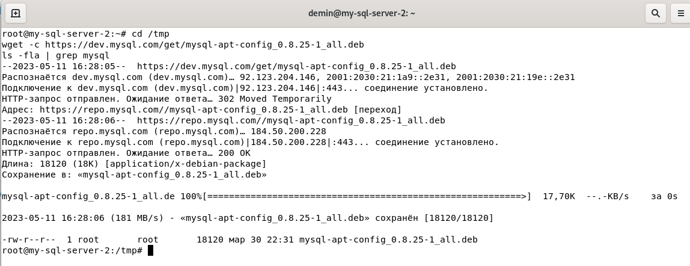

# Домашнее задание к занятию «Репликация и масштабирование. Часть 1» Андрей Дёмин

### Задание 1

На лекции рассматривались режимы репликации master-slave, master-master, опишите их различия.

<ins>*Ответ*</ins>:

1) в режиме Master-Slave новые данные пишутся только на Master, а со Slave они только читаются; в режиме Master-Master данные активно пишутся на оба сервера;
2) Отказоустойчивость. Master-Slave: при недоступности Master его роль исполняет один из Slave, возможна потеря части данных. Master-Master: при отказе одного сервера данные можно получить без потерь с другого сервера;
3) Целостность БД. Master-Slave: после потери и восстановления связи данные с Master будут дописаны в Slave до актуального состояния. Master-Master: после потери и восстановления связи между серверами возникает конфликт и нарушение целостности данных.

---

### Задание 2

Выполните конфигурацию master-slave репликации, примером можно пользоваться из лекции.

*Приложите скриншоты конфигурации, выполнения работы: состояния и режимы работы серверов.*

Для выполнения задачи подготовлены 2 ВМ на базе Debian 11:


<ins>1.Установка репозитория MySQL 8</ins>

Предварительно нужно установить пакет gnupg.
```
apt-get install gnupg
```
Установка MySQL APT репозитория:
```
https://dev.mysql.com/downloads/
```
Загрузка пакета:
```cd /tmp
wget -c https://dev.mysql.com/get/mysql-apt-config_0.8.25-1_all.deb
ls -fla | grep mysql
```


Установим пакет:
```
dpkg -i mysql-apt-config_0.8.25-1_all.deb
```
После установки пакета в /etc/apt/source.list.d/ добавится mysql.list.


Обновляем репозиторий:
```
apt-get update
```
<ins>2.Установка MySQL 8</ins>
```
apt-get install mysql-server
```


<ins>3.Настройка безопасности</ins>

Для настройки безопасного доступа к MySQL существует специальный скрипт:
```
mysql_secure_installation
```
Он позволяет настроить следующие параметры:

-VALIDATE PASSWORD COMPONENT — использовать компонент VALIDATE PASSWORD? (No)

-Изменить пароль от root? (No)

-Удалить анонимных пользователей? (y)

-Запретить удалённый логин под root? (y)

-Удалить тестовую базу и доступ к ней? (y)

-Обновить таблицу привилегий? (y)

Проверка статуса:
```
systemctl status mysql
```


Проверка на автозагрузку:
```
systemctl is-enabled mysql
```
Если MySQL не запускается автоматически:
```
systemctl enable mysql
```

<ins>4.Перемещение базы данных MySQL 8</ins>

База данных MySQL 8 при установке по умолчанию пишется в папку /var/lib/mysql. Со временем база растёт и поднимается вопрос переноса её на другой раздел диска. Перенесём базу данных в /opt/mysql/mysql.

Создадим директорию для MySQL:
```
cd /opt
mkdir mysql
ls -Fla
```
Проверим где находится текущая БД MySQL.
```
mysql -u root -p
select @@datadir;
```


Останавливаем сервер MySQL:
```
systemctl stop mysql
```
Проверяем статус, мы должны убедиться, что сервер MySQL остановлен:
```
systemctl status mysql
```


С помощью rsync (предварительно установить) переносим MySQL в другую папку:
```
rsync -av /var/lib/mysql /opt/mysql
```
Переименуем старую папку /var/lib/mysql, сохраним её на случай сбоя:
```
mv /var/lib/mysql /var/lib/mysql.bak
```
По умолчанию путь настроен в файле /etc/mysql/mysql.conf.d/mysqld.cnf, редактируем:
```
nano /etc/mysql/mysql.conf.d/mysqld.cnf
```
В строке datadir= указать путь к новому каталогу данных /opt/mysql/mysql
```
datadir =  /opt/mysql/mysql
```
MySQL при запуске проверяет наличие директории /var/lib/mysql/mysql . Чтобы он не ругался, создадим пустую папку:
```
mkdir /var/lib/mysql/mysql -p
```
Запускаем MySQL:
```
systemctl start mysql
systemctl status mysql
```
Проверяем текущий путь:
```
mysql -u root -p
select @@datadir;
```


<ins>5.Настройка Master-node</ins>

Настроим конфигурацию:
```
nano /etc/mysql/mysql.conf.d/mysqld.cnf
```
```
[mysqld]
pid-file        = /var/run/mysqld/mysqld.pid
socket          = /var/run/mysqld/mysqld.sock
datadir         = /opt/mysql/mysql
log-error       = /var/log/mysql/error.log

server-id = 1
log-bin = /var/log/mysql/mysql-bin.log
tmpdir = /tmp
binlog_format = ROW
max_binlog_size = 500M
sync_binlog = 1
expire-logs-days = 7
slow_query_log
```


Перезапускаем сервис:
```
systemctl restart mysql
```
Создадим учетную запись Master для сервера репликации и предоставим права:
```sql
CREATE USER rep_user@192.168.0.18 IDENTIFIED BY 'password';
alter user rep_user@192.168.0.18 identified with mysql_native_password by 'password';
grant replication slave on *.* to rep_user@192.168.0.18;
FLUSH PRIVILEGES;
```


Статус привилегий:
```sql
show grants for rep_user@192.168.0.18;
```


Проверка статуса Master-node:
```sql
show master status\G
```


<ins>6.Настройка Slave-node</ins>

Настроим конфигурацию:
```
nano /etc/mysql/mysql.conf.d/mysqld.cnf
```
```
[mysqld]
pid-file        = /var/run/mysqld/mysqld.pid
socket          = /var/run/mysqld/mysqld.sock
datadir         = /opt/mysql/mysql
log-error       = /var/log/mysql/error.log

log_bin = /var/log/mysql/mysql-bin.log
server-id = 2
read_only = 1
tmpdir = /tmp
binlog_format = ROW
max_binlog_size = 500M
sync_binlog = 1
expire-logs-days = 7
slow_query_log   = 1
```


Перезапускаем сервис:
```
systemctl restart mysql
```
Инициализация процесса репликации:
```sql
CHANGE MASTER TO MASTER_HOST='192.168.0.16', MASTER_USER='rep_user', MASTER_PASSWORD='password', MASTER_LOG_FILE='mysql-bin.000002', MASTER_LOG_POS=157;
```


Запуск репликации:
```sql
start slave;
```
Статус Slave-node:
```sql
show slave status\G
```


<ins>7.Тестирование</ins>

Смотрим БД на Master & Slave:
```sql
show databases;
```


---


Создаем БД на Master-node:
```sql
create database test1
```


Проверяем репликацию БД на Slave-node:
```sql
show databases;
```


---

## Дополнительные задания (со звёздочкой*)
Эти задания дополнительные, то есть не обязательные к выполнению, и никак не повлияют на получение вами зачёта по этому домашнему заданию. Вы можете их выполнить, если хотите глубже шире разобраться в материале.

---

### Задание 3* 

Выполните конфигурацию master-master репликации. Произведите проверку.

*Приложите скриншоты конфигурации, выполнения работы: состояния и режимы работы серверов.*
